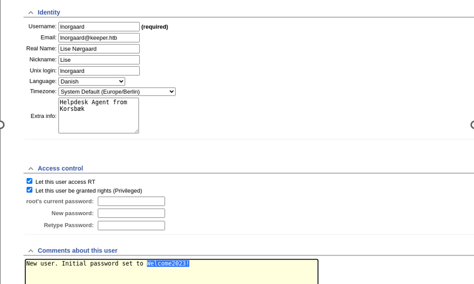

# Keeper

Hello to everyone! This is my first walktrough. My aim is to be as clear as possible providing a lot of technical details that usually do you not find online. Also, my intention is to improve myself into explanation tasks (according the Learning Pyramid it is the best way to learn and improve yourself). 
I hope to catch your attention :). Any comments and doubts are welcome. Now start together into Keeper machine analysis!

## Table of contents
1. [Introduction](#introduction)
2. [User flag](#userflag)
3. [Root flag](#rootflag)
4. [Conclusion](#conclusion)

## Introduction 

In this document there are two main sections. The first focused into find user flag, while the second regards the root flag.

## User flag 

Using NMAP to gather information regarding the open ports I have discovered that **SSH** and **HTTP** service are available respective over the ports 22 and 80.

*Figure 1: NMAP scanning to search for services*

* * *
**Little Parenthesis**: When I know that an host is online I usually use the *-Pn* parameter. In this way no host discovery is done before the ports scan operation start. According to me it is a best practice in real life scenario to reduce your noise over the network. 
* * *

I have added the IP provided by HTB into **/etc/hosts** file associating it to **keeper.htb** domain. Then I am ready to start the investigation about which kind of web service is running on.

*Figure 2: keeper.htb html page*

There is a redirection to an other address. It redirects to the URL reported in the html page: *http://tickets.keeper.htb/rt/*

*Figure 3: Logging page for RT portal*

In this logging web page are reported the information about the software brand and its version. The software is the **RT portal** version **4.4.4+dfsg-2ubuntu1 (Debian)**  (in this way we have also discovered that the machine has the Debian OS).

In this scenario, I have searched online for the default credential for the RT portal. I have found that **root** and **password** are respective the default username and passwords.  This is rare, however it is a plausible scenario.

In the top of the page there is a menu bar where is possible to select the wish view.

In this case, entering in the panel regarding the user **lnorgaard** page (go in Admin --> User --> lnorgaard) is possible to find clear text credentials.

*Figure 4: Cleartext password for the user lnorgaard*

Since ssh service is available, it is legitimate to try it the password is still valid.

The password is still valid, and it can be a real word scenario. Unfortunately, a lot of user do not change the default password.

*Figure 5: Successfull ssh login with the user lnorgaard*

## Root flag 

Analyzing the content of the user home directory is possible to discover that there is a zip file. It belongs to root user so it is a synonymous of useful information. I was able to open it because all users are able to read it (other misconfiguration).

*Figure 6: Content of  lnorgaard's home directory*

I have used `unzip` tool to extract the content and it contains:
- A KeePass dump file
- A KeePass db.

*Figure 7: After the extraction of the content stored into zip file*

I have searched online about KeePass vulnerabilities and there is the **CVE-2023-32784** that affects all the KeePass versions previous the **2.54** that was released in 6 June 2023. 
Therefore, since the file modification date is set before the release date of version 2.54 it is possible to exploit the CVE-2023-32784 vulnerability.

In order to get the password I have used the script provided in this repo -->  [link](https://github.com/z-jxy/keepass_dump/tree/main)

* * *
**First observation about the script:** In real life scenario I think that the best way is to transfer the file to process (and all relative processing script) into local machine in order to reduce the amount of generated noise.  
**Second observation about the script**: The script in my system gives error about the function `to_bytes()`  asking to me to specify its parameters. For this reason I have changed all the **to_bytes()** with **to_bytes(length=1, byteorder='big')**
* * *

The CVE-2023-32784 exploit let us to extract the MasterKey password with the exception of the first character as displayed in the *Figure 8*. The `--skip` and `--debug` parameters are suggested by the author in the README file.

*Figure 8: Output of the KeePass dump script*

The MasterKey password is something like: *dgrd med fled or *dgre med fled (where the * char is the unknown character).

I have searched on google these words. It have suggested to me that they refers to the danish dish named **rødgrød med fløde**.

*Figure 9: Google suggestion for the words **dgrd med fled***

Effectively, I was successfully able to open the passcodes.kdbx file using these words.

*Figure 10: passocdes.kdbx open*

In the root's *Notes* field is possible to see that is specified a PuTTY privatekey that probably can be exploited to enter into system as root. [Here](https://tartarus.org/~simon/putty-snapshots/htmldoc/AppendixC.html) is possible a lot of details regarding the PuTTY Privatekey file (named PPK file).

Saving the content into a file (that I have named rsa.ppk) is possible to convert it to a **pem file** using the tool `puttygen` (as displayed into Figure 11) in order to login as root. Otherwise, it is possible to connect to the host via PuTTY uploading the PPK file.

*Successfull enter as root into keeper host via ssh*

In the above screen the `puttygen` parameters are: 
- **-O**: used to specify the type of output you want puttygen to produce
-  **-o**: Specify the file where puttygen should write its output.

For more details I suggest to you to read the clear manual page.

## Conclusion 

Thanks to all for the attention. Since it is my first article about htb walkthrough please help me to improve :). Any hint is welcome. 

