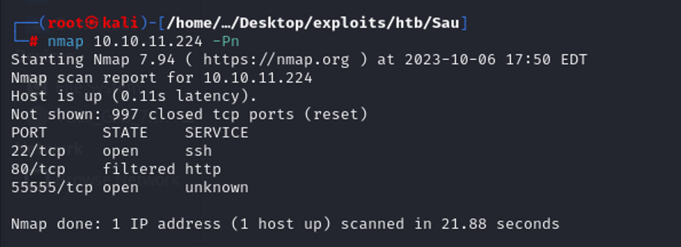
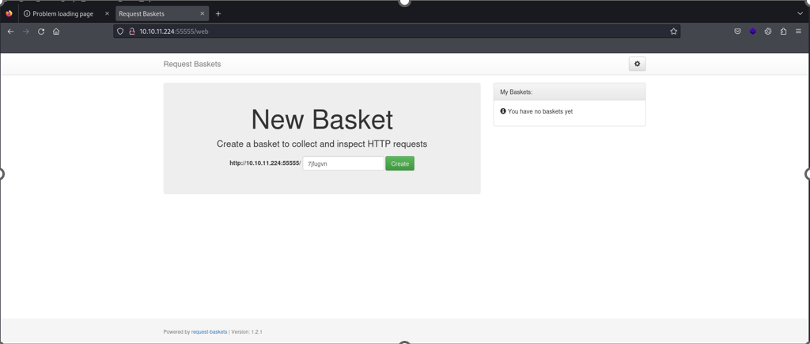
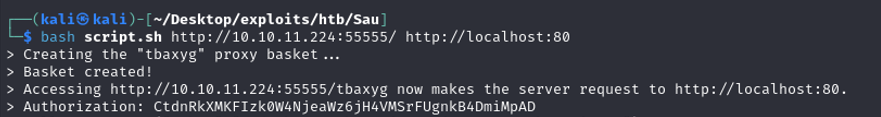
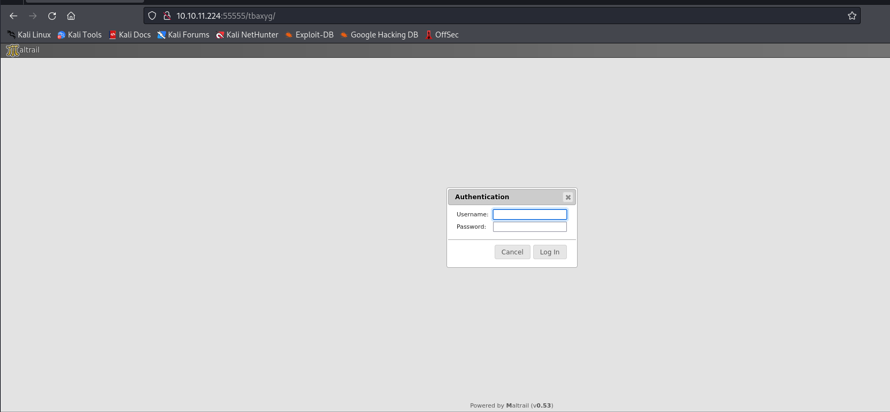
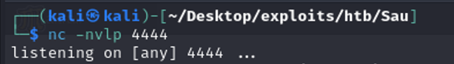
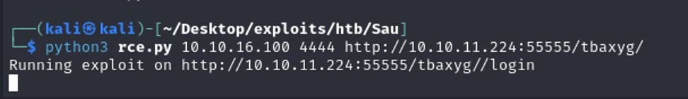
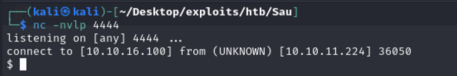
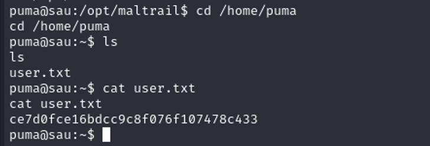
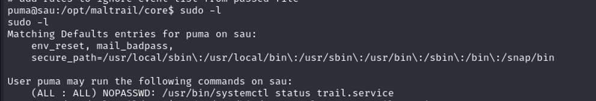
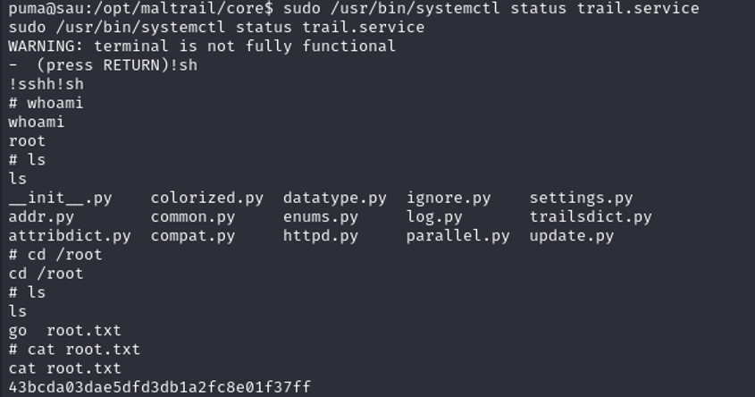

# Sau

Hello to everyone!! I am back with the analysis of the Sau machine. It is an Easy machine, in fact I will show you that is possible to get it with some simple Google searches.

## Table of contents
1. [Introduction](#introduction)
2. [User flag](#userflag)
3. [Root flag](#rootflag)
4. [Conclusion](#conclusion)

## Introduction <a name="introduction"></a>

As in my last document, here there are two main sections. The first focused into find the user flag, while the second regards the root flag.

## User flag <a name="userflag"></a>

As I have already reported in my last wallkthrough, I usually start the investigation scanning the open ports of the host with the `-Pn` flag (since the SUA machine is online)

*Figure 1: NMAP scanning to search for services*


The url http://10.10.11.224:55555 redirected me to the following web page:

*Figure 2: Requests Baskets version 1.2.1 web page*

The running service is **Requests Baskets version 1.2.1**.

***
**Request Baskets** is a web service to collect arbitrary HTTP requests and inspect them via RESTful API or simple web UI.
***

I have searched online about any CVE regarding this service and I have found the following: **CVE-2023–27163**. 
In the details, it is possible to carry out Server Side Request Forgery through the Request-Baskets 1.2.1. It is possible to exploit this vulnerability to reach service that are unricheable from the external. 

[Here](https://medium.com/@li_allouche/request-baskets-1-2-1-server-side-request-forgery-cve-2023-27163-2bab94f201f7) is possible to get more details about the CVE and also the script that I have used to exploit it.
Analyzing the other ports reported in the screen, the port 80 is in a filtered status. In fact, any HTTP request to this port did not work. For this reason the idea is to exploit the  **CVE-2023–27163** in order to create a communication channel with the filtered service via loopback address (or localhost).

*Figure 3: Script and parameters to exploit the CVE-2023–27163. The first parameter is the Request Baskets URL. The second is the URL of the service the target service*


Following the url computed by the bash script (the request bucket url of the above screen) is possible to reach the service running over the port 80, as showed below.

*Figure 4: Maltrail version 0.53 web page*

The service running over the port 80 is **Maltrail version 0.53**. 

***
Maltrail is a malicious traffic detection system, utilizing publicly available (black)lists containing malicious and/or generally suspicious trails, along with static trails compiled from various AV reports and custom user defined lists, where trail can be anything from domain name, URL, IP address or HTTP User-Agent header value . Also, it uses (optional) advanced heuristic mechanisms that can help in discovery of unknown threats (e.g. new malware).
***

Searching online the Maltrail version 0.53 is vulnerable to RCE as explained in the following [link](https://packetstormsecurity.com/files/174221/Maltrail-0.53-Unauthenticated-Command-Injection.html).

The code to exploit this vulnerability is [here](https://www.exploit-db.com/exploits/51676) reported. 

The aim of this attack is to exploit the "tunnel" obtained though the Requet Buckets in order to inject a reverse shell via Maltrail version 0.53 vulnerabilities.  

Therefore, first of all I have put my machine to listen all incoming connection on the port 4444 as showed in Figure 5.

*Figure 5: Listen for a new connection on port 4444*

Then, as showed in Figure 6, I have run the python script. The first parameter is my machine IP, the second is the port that my machine was listen on, the third parameter is the URL of the Maltrail version 0.53

*Figure 6: Execution of the python exploit script.*

Finally, Figure 7 shows the successful connection obtained by host Sau.

*Figure 7: Successfull connection*

The user flag is under puma home directory.

*Figure 8: User flag found*

**Tips**:

I sugget to you the following two commands in order to get a more robust shell

```bash

# First
python3 -c 'import pty;pty.spawn("/bin/bash")'

# Second
tty
```


## Root flag <a name="rootflag"></a>

In order to check if there any action that puma user could do as root I have discovered that is able to run (as root) the command displayed in the Figure 9.

Here follows the exlaination concerning `-l` parameter for `sudo` command: 
***
`-l[l] [command]`
If no command is specified, the **-l** (list) option will list the allowed (and forbidden) commands for the invoking user (or the user specified by the **-U** option) on the current host. If a command is specified and is permitted by the security policy, the fully-qualified path to the command is displayed along with any command line arguments. If command is specified but not allowed, **sudo** will exit with a status value of 1. If the **-l** option is specified with an l argument (i.e. **-ll**), or if **-l** is specified multiple times, a longer list format is used. 
***
*Figure 9: sudo -l output*

An other important misconfiguration that the command displayed into Figure 9 can be executed without the user authentication (ALL: ALL) **NOPASSWD**.

I have searched online how to exploit this features, I have found this useful article that talks about the systemctl status exploit ([link](https://exploit-notes.hdks.org/exploit/linux/privilege-escalation/sudo/sudo-systemctl-privilege-escalation/#spawn-shell-in-the-pager)). The reference is also [gtfobins](https://gtfobins.github.io/gtfobins/systemctl/)
If we can execute systemctl status as root, we can spawn another shell in the pager.
Just run the command with sudo and then in pager entering into the **!sh** command.  
All these steps are displayed in the Figure 9.

*Figure 10: Steps to obtain root flag*


## Conclusion <a name="conclusion"></a>

As you can see it is possible to find the flags for this machine in a very easy way.  Again, yhanks to all for the attention. Any hint is welcome. 
